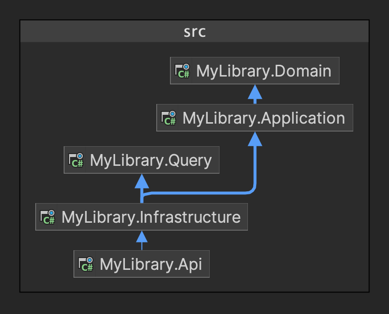

# My Library

An API for managing a library. It provides the following functionality:

- **Books**

  - Add books (for users with the right permissions).
  - List books.
  - Search for books by title.
  - Borrow books.
  - Return books.
  - Reserve a book for 24 hours. If user doesn't borrow the book within the time, the reservation will automatically expire.
  - Cancel reservation
  - List borrowed books.
  - List reserved books.

Check out the [documentation](https://github.com/vince-nyanga/my-library/wiki/API-documentation) for more information on the functionality it provides.

- **Profile**

  - Add/update logged in user's profile.
  - Get logged in user's profile.

- **Notifications**
  - List all unread notifications.
  - Mark a notification as read.
  - Mark all notifications as read.

## Running The Project

You can run the project directly on you computer or using Docker. However, there is something you need to do first:

### Setup Auth0

The project uses Auth0 for authentication and authorization so you will need to have an API on Auth0. Once you have that setup, you need to do the following:

- Add the Auth0 config to the `appsettings.json` file or the `docker-compose.yml` file if you're using Docker:

```json
"Authentication": {
    "Domain": "<auth0-domain>",
    "Audience": "<auth0-audience>",
    "ClientId": "<auth0-api-client-id>"
  }
```

- Add a permission `'add:books'` to you API on Auth0. This permission allows a user to add books to the catalog. Assign it to one of your users so you may be able to add new books.

## Run Application

- If you're running locally (not on Docker), ensure you have PostgresSQL database installed and running on your computer, then simply run it like you would any other .NET application. If you are using Docker, run the following commands:

```shell
docker compose build

docker compose up
```

- Navigate to http://localhost:5261/swagger/index.html, where you will see a Swagger UI through which you can test the API.
- Ensure you sign in by clicking on the _Authorize_ button on the top right of the screen.
- Before you do any thing, update your profile because most of the functionality depends on the availability of a user profile for the logged in user. User the `Profile` section, use the `POST` endpoint to add your profile details. Once done, you may test all the endpoints.

> [!WARNING]
> If your don't update/add your profile most endpoints will fail.

## Architecture And Design

The system is built using a combination of Clean Architecture, Command Query Responsibility Segregation (CQRS) and Domain Driven Design (DDD). Below is a diagram showing the the system design overview.



Here's the breakdown of the projects in the solution:

1. **MyLibrary.Domain**: This is the innermost layer in our project. It contains our entities as well as domain events. There are two aggregate roots (`Book` and `Customer`). Most, if not all of the business logic is handled in this project.
2. **MyLibrary.Application**: This is where the application services live. It contains commands (for CQRS) and their handlers, abstractions for command and event dispatchers, repository interfaces, as well as generic exceptions that will be surfaced to the API. I decided not the surface exceptions thrown in the domain, or any other domain class bar a few such as `IDomainEvent` to the API. The application layer catches all the domain exceptions and throws a more generic exception that the API will then convert into a `ProblemDetails` to be returned to the user.
3. **MyLibrary.Query**: This project is on the same level as `MyLibrary.Application` but handles the query side of the CQRS. As you can see from the image above, it does not depend on the domain at all. Instead, it defines its own read models that sort of match the domain models. It also contains queries and their handlers, as well as interfaces for the query services.
4. **MyLibrary.Infrastructure**: This is where the infrastructure is defined. It contains the two EF Core database context, one for writing -- used in `MyLibrary.Application` and one for reading (querying), used by in `MyLibrary.Query`. All the interfaces defined in the deeper layers are defined in this project.
5. **MyLibrary.Api**: This is the entry point to our application.

### Channels

The project uses [channels](https://learn.microsoft.com/en-us/dotnet/core/extensions/channels) to implement a simple producer-consumer pattern for sending notifications to the user (at the moment, we're just adding the notifications to the database). After saving the aggregate roots, the `DbContext` writes the domain events raised by the aggregate to a channel, to which a `BackgroundService` listens for new events. The background service then dispatches the events in a separate thread, thereby improving the performance of the application by freeing up the main thread.

## Scheduled Tasks

The project uses [Coravel](https://docs.coravel.net/) to schedule a background job that cleans up expired book reservations.

## Things To Do

- Add more tests to all layers.
- Add more features.
- Clean up a few things.
